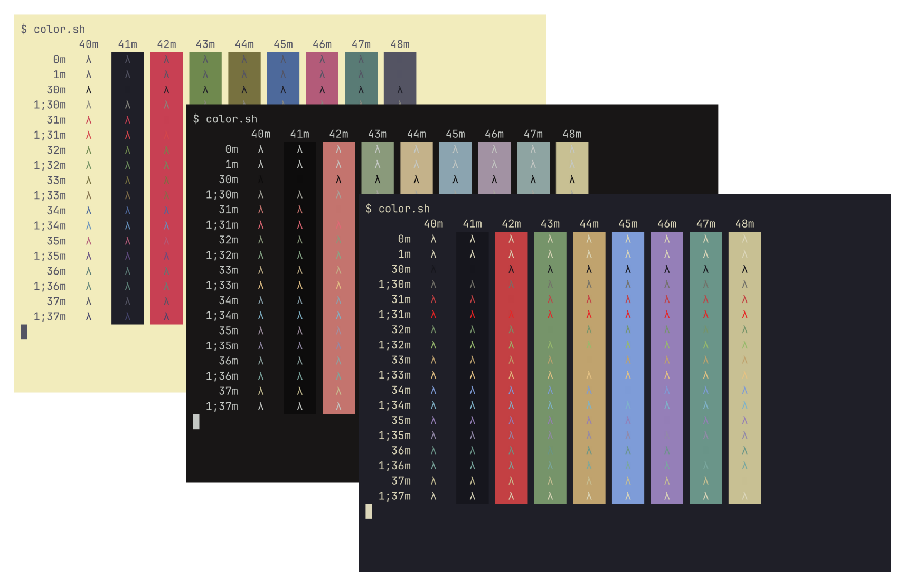

# `color.sh` - Test terminal colors with POSIX shells

##### Original by [Daniel Crisman].



###### Generated using [`agg`], colors by [`kanagawa.nvim`].

## Getting Started

### Prerequisites

- A [POSIX.1-2017] compliant shell, or any of the ones listed
  in [Supported shells](#supported-shells).

### Installation

Paste in a macOS Terminal or Linux shell prompt:
```sh
/bin/sh -c "$(curl -fsSL https://github.com/Neved4/color.sh/tree/master/install.sh"
```

### Usage

```color.sh [bg | fg | table]```

### Portability

#### Supported shells

|      Shell | Version       | Supported |
| ---------: | :------------ | :-------- |
|   [`bash`] | `5.2.15`      | Yes       |
|   [`dash`] | `0.5.12`      | Yes       |
|  [`ksh93`] | `93u+m/1.0.7` | Yes       |
|   [`mksh`] | `59c`         | Yes       |
|   [`oksh`] | `7.3`         | Yes       |
|    [`osh`] | `0.18.0`      | Yes       |
|   [`posh`] | `0.14.1`      | Yes[^1]   |
|   [`yash`] | `2.55`        | Yes       |
|    [`zsh`] | `5.9`         | Yes       |
| [`elvish`] | `0.19.2`      | No        |
|   [`etsh`] | `5.4.0`       | No        |
|   [`fish`] | `3.6.1`       | No        |
|   [`tcsh`] | `6.21.00`     | No        |
|    [`nsh`] | `0.4.2`       | No        |
|     [`nu`] | `0.85.05`     | No        |
|    [`ysh`] | `0.18.0`      | No        |
|  [`xonsh`] | `0.14.1`      | No        |

## Benchmarks

Note that while [`scolor.sh`] provides a more elegant implementation,
[`color.sh`] more effectively demonstrates the performance of every shell.
See [Benchmarks](doc/Benchmark.md).[^2]

## Standards

This script conforms to [ISO 9945:2009][POSIX.1-2017], also known as
[POSIX.1-2017].[^3]

## License

This repository is licensed under the terms of the [MIT License].
   
See the [LICENSE](LICENSE) file for details.

## Acknowledgments

Special thanks to [@mirabilos](https://github.com/mirabilos) for the many
suggestions, corrections and feedback.

[^1]: To accomodate `posh`, parameter substitution had to be used.
      See: [What does `${1+"$@"}` mean | Sven Mascheck].
[^2]: Note that `pdksh` derived shells, such as `mksh`, `oksh` or `poskh`,
      have a higher [fork-exec] penalty when using `/usr/bin/printf`,
      compared to the [Korn shell] built-in `print`. Targeted code was
      introduced to precisely assess performance.
[^3]: _IEEE Std 1003.1-2017: Standard for Information Technology — Portable_
      _Operating System Interface (POSIX®)_, ISO/IEC/IEEE 9945:2009/COR
      2:2017. URL: https://pubs.opengroup.org/onlinepubs/9699919799/

[`agg`]: https://github.com/asciinema/agg
[`color.sh`]: src/color.sh
[`kanagawa.nvim`]: https://github.com/rebelot/kanagawa.nvim
[`scolor.sh`]: src/scolor.sh
[Daniel Crisman]: https://tldp.org/HOWTO/Bash-Prompt-HOWTO/x329.html
[fork-exec]: https://en.wikipedia.org/wiki/Fork%E2%80%93exec
[Korn shell]: https://web.archive.org/web/20151025145158/http://www2.research.att.com/sw/download/man/man1/ksh.html
[MIT License]: https://opensource.org/license/mit/
[POSIX.1-2017]: https://pubs.opengroup.org/onlinepubs/9699919799/
[What does `${1+"$@"}` mean | Sven Mascheck]: https://www.in-ulm.de/~mascheck/various/bourne_args/

[`bash`]: https://git.savannah.gnu.org/cgit/bash.git/
[`dash`]: https://git.kernel.org/pub/scm/utils/dash/dash.git
[`ksh93`]: https://github.com/ksh93/ksh
[`mksh`]: https://github.com/MirBSD/mksh
[`osh`]: https://www.oilshell.org/cross-ref.html?tag=OSH#OSH
[`oksh`]: https://github.com/ibara/oksh
[`posh`]: https://salsa.debian.org/clint/posh
[`yash`]: https://github.com/magicant/yash
[`zsh`]: https://github.com/zsh-users/zsh
[`elvish`]: https://github.com/elves/elvish
[`etsh`]: https://etsh.nl/
[`fish`]: https://github.com/fish-shell/fish-shell
[`nsh`]: https://github.com/nuta/nsh
[`nu`]: https://github.com/nushell/nushell
[`tcsh`]: https://github.com/freebsd/freebsd-src/tree/main/bin/csh
[`ysh`]: https://www.oilshell.org/cross-ref.html?tag=YSH#YSH
[`xonsh`]: https://xon.sh/
